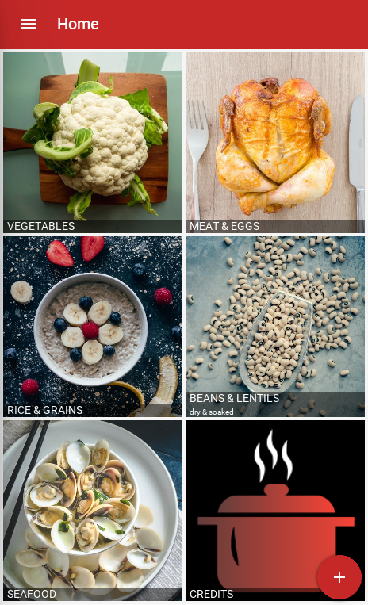
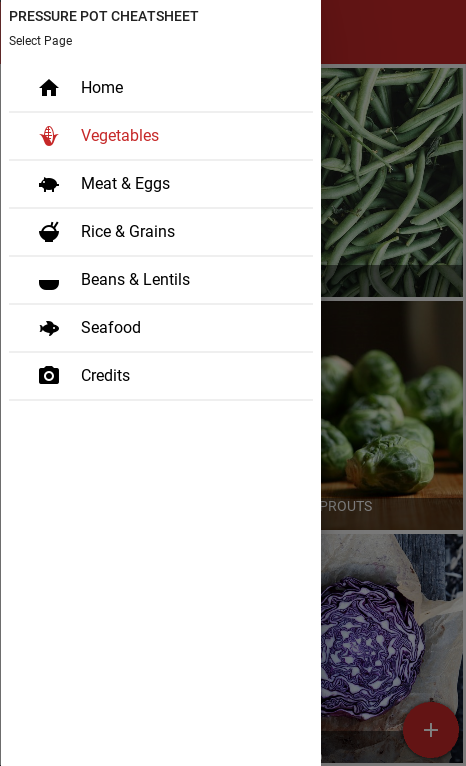

# pressure-pot-cheat-sheet

## Description

This app was created using the [Kivy](https://github.com/kivy) framework and [KivyMD](https://github.com/HeaTTheatR/KivyMD) library (for Material Design themed widgets). The aim was to create a fully customizable pocket reference for various ingredient cook times when using InstantPot and other consumer electric pressure cookers.

Currently, pressure cooker (and slow cooker) apps are focused on full recipes. Pressure Pot Cheat Sheet seeks to be the opposite. Although each user can add recipes in the "Notes" section of each ingredient, the app comes somewhat barebones to accommodate individual needs and tastes. Ideally, this will foster creativity and direct the user's focus toward cooking by removing the rigidity of recipes.

### Sample Screenshots

 

### 🥔-quality GIF

*The master branch currently only contains code for running Pressure Pot Cheat Sheet on Windows, Mac OS and Linux. I anticipate having PPCS on the Google Play Store for Android devices in late July or early August, 2020.*

## Features

* Clean, distraction-free Material Design themed interface
* 50+ default ingredients with customizable "Notes" section
* Unlimited user-created custom ingredient pages - add, edit, and delete as many as you want!
* Upload your own pictures for custom ingredients - zoom, rotate and position your photo to achieve the ideal crop
* Discover new artists and photographers through the "Credits" screen - clicking on each list item will open the browser to the photographer's portfolio
* 100% local database storage for guaranteed offline use

## Potential Future Features

**These are highly dependent on the amount of free time I have, user interest and/or donations*

* Native Android file browser for selecting photos (currently working on making [Plyer](https://github.com/kivy/plyer) filechooser more robust for Android, allowing user to select photos through "Gallery" and other media managers) - ETA: TBD
* iOS build - ETA: N/A (I currently don't have access to a Mac for testing/XCode packaging, but would love to get the app on the Apple App Store)
* Take photo directly through the app/native camera for adding ingredients - ETA: TBD
* Include built-in timer or open native Android timer to streamline app usage while cooking - ETA: TBD

## Install and Run App on Your Desktop

* Install Python 3.7 from [python.org](https://www.python.org/downloads/) or [Anaconda](https://www.anaconda.com/products/individual)
* [Install Kivy](https://kivy.org/doc/stable/gettingstarted/installation.html)
* Clone this repo or download the .zip file and unzip
* Navigate into the directory with your terminal and run `python main.py` (or `python3 main.py` on Linux)
